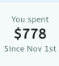
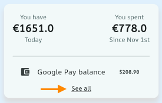
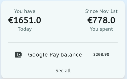
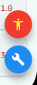

**Open this document in a markdown previewer and reveal its true form!**

   

# Accessibility Workshop

> *Greetings, explorer! 
You've entered an app where semantics and accessibility were overlooked.  
Your task is to navigate through this digital landscape and concure critical issues.  
> You won't be alone on this quest, you have been teamed up with a fellow developer to tackle the challenges together!*
> 
> *Don’t worry, the instruction below will guide you through every phase of the journey. 
Good luck, and remember, every improvement you make brings the app closer to victory!*

 

### Inventory 🎒
In your inventory you find two screen readers;
VoiceOver and TalkBack. 
 Choose the one that is available for your device as it will be needed throughout this workshop
 

#### Table of Contents
- [Accessibility Workshop](#accessibility-workshop)
    - [Inventory 🎒](#inventory-)
      - [Table of Contents](#table-of-contents)
- [Chapter 1](#chapter-1)
  - [The urge to merge](#the-urge-to-merge)
  - [Picture This... Or Maybe Not!](#picture-this-or-maybe-not)
  - [Use those props](#use-those-props)
  - [Control the semantic nodes](#control-the-semantic-nodes)
  - [Focus flow](#focus-flow)
- [Chapter 2](#chapter-2)
  - [Text scaling](#text-scaling)
  - [Contrast](#contrast)
  - [The Accessibility Audit 🚀](#the-accessibility-audit-)
  
 
 

# Chapter 1 

## The urge to merge 

> *When merging semantics, don’t panic! Stay cool, stay chill no need for dramatics. 
> With the screen reader, explore the home page with ease,
> Improve navigation — make browsing a breeze*

We have detected areas where widgets should be merged into a single semantic node  
You've been provided images to make the task at hand easier for you

 

 
 

## Picture This... Or Maybe Not! 

> *Not all elements are critical for navigating. Some objects in this world bring no value to the mighty screen reader. They are but decorative relics, mere distractions in the grand quest for accessibility!*
 

Let's go ahead and remove the images detected by screen readers from semantics

 
 

## Use those props

> *It is time to unlock the full power of your UI and grant your app the strength of clarity.  
> Use the properties well, for with great accessibility comes great user experience*

Here is the widget that needs improvement

 

1. See all, but see all what? Let's give our users a hint of what it revealed when clicking this button
   
 

2. Let's go ahead and specify the action type 
   
 

1. Flutter guidelines recommend making interactive elements, such as buttons, at least 48x48.  Go ahead and apply this to this text button

   

1. Lastly, You will give the entire balance card the explicit label 'Balance card'. But make sure that the children within are still detected by the screen readers 

 

## Control the semantic nodes

> *Brave explorer, the path ahead is tricky! Figure out a way to shield hidden widgets from screen readers*

 

On the balance card, elements that are hidden on the screen are detected by the screen reader  
Figure out how you can hinder semantics nodes from detection whilst they're hidden on the screen

 

## Focus flow 

> *You stand at the precipice of a great challenge: taming the semantic flow. The forces of accessibility and screen readers demand order, but your widgets are chaotic.
> To do so you must order the semantics nodes correctly. Now, go forth, Flutter warrior—bring order to the chaos* 

 

When arriving on the home page you will make sure that the title is being read my the screen reader focusing on the search bar

 
 

# Chapter 2

> *You have come a long way in your semantics journey and I salut you. 
However much semantics counts. We also have to take into consideration other factors such as color contracts, text scalors etc.  
> The app has been fortified with a powerful Accessibility tool, a tool designed to unveil hidden flaws lurking in the shadows.  
> Activate it in the main! No detail is too small. 
> Inspect every corner, every button...*

 

## Text scaling

> *A hidden force lurks within every device — **text scaling**. It is controlled by the user’s sacred settings!  
> The challenge before you is clear: the app must be adaptive to honor these preferences*

 

1. Use the Accessibility tools package to increase the text scale factor to 2. If you find any overflow errors you should think of a way to correct them

 

2. Next you will go ahead and set the text scale range in the app to 0.8-1.9

    You find a flutter news paper on the floor which contains an intersting article that might help you in this endevor
https://medium.com/@pomis172/properly-handling-text-scaling-in-flutter-313fe717816c

 

## Contrast

> *Text fading into the background, buttons blending into oblivion! Many users, from those with visual impairments to those navigating in bright sunlight, struggle to see what lies before them*  
> *You must wield the power of strong color contrast to ensure that UI elements stand boldly against their backgrounds*

We have covered a lot already but lastly let's make sure that our app is clearly readable

There are few tools that can check the contrast properly. There is the Accessibility scanner app for Android. So if you are in posession of one you are lucky !

 

We've made it easy for you... You should be able to detect the color contrast errors simply by using your eyes 👀

 

## The Accessibility Audit 🚀

> *Grab your gear and launch the Accessibility Inspector in Xcode. Let’s uncover any hidden obstacles and level up our app’s accessibility! 🔍
> This powerful tool will scan our app and reveal hidden obstacles, giving us hints on what can be improved.
> Fix all the issues, clear the path, and when you're done head over to the next tool!*

A the rare kind not bound to a Mac you are free to bypass this trial! While others must forge ahead, you may step aside, your path unburdened by this task.

1. The app has been fortified with a powerful Accessibility Scanner, a tool designed to unveil hidden flaws lurking in the shadows. Activate it in the main! No detail is too small—inspect every corner, every button. But beware… the BottomSheets may hold secrets that others overlook.

    

